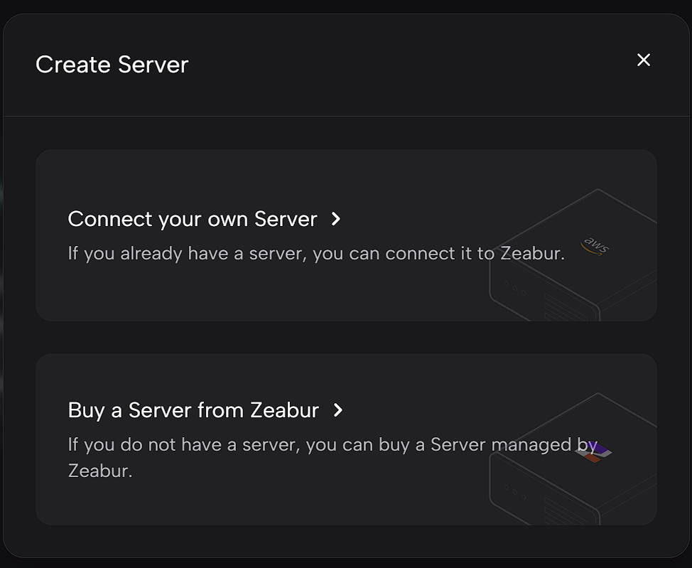
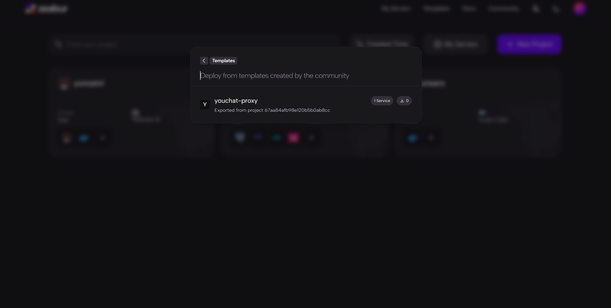
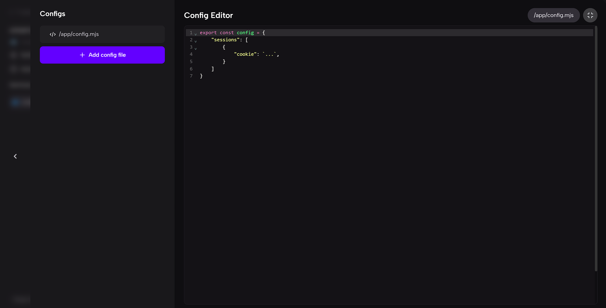
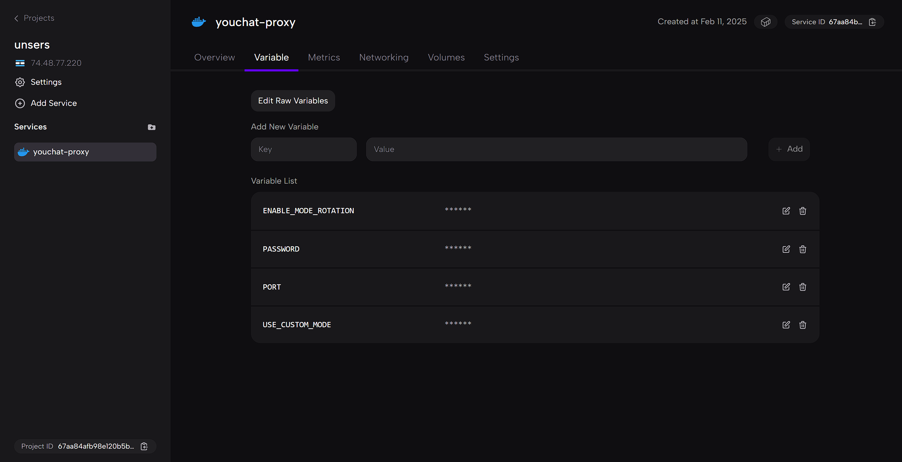
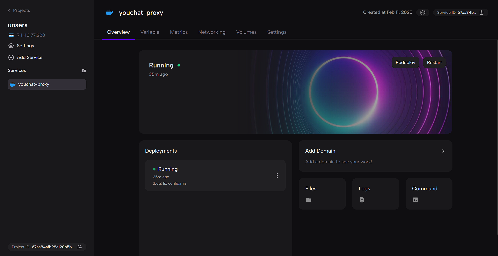
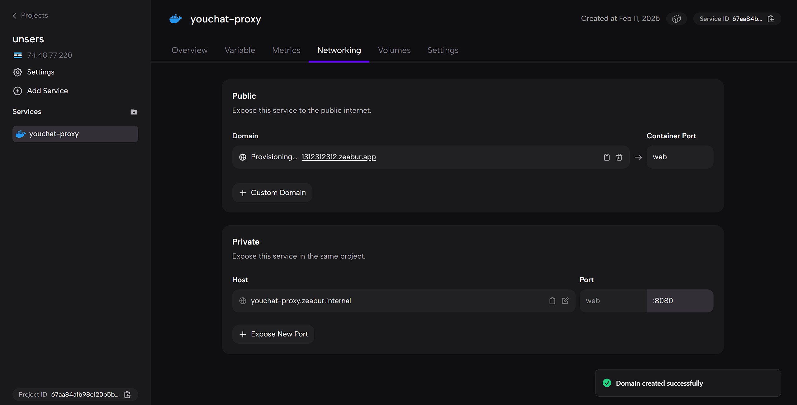
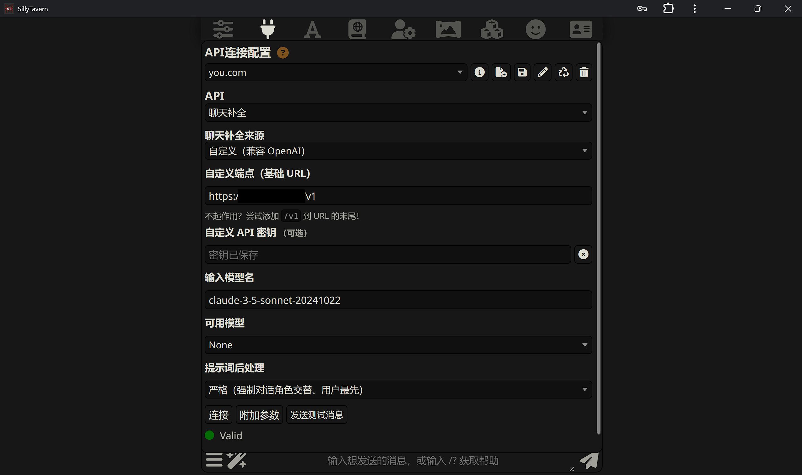

# 使用Zeabur一键部署YOU反代服务

::: tip
本项目基于:https://github.com/YIWANG-sketch/YOUChat_Proxy  
以及:https://github.com/yunzaixi-dev/YOUChat_Proxy  
在开始前,你需要拥有一台海外vps(请参考其它教程获取),并注册[Zeabur](https://zeabur.com?referralCode=yunzaixi)账号  
若您是开发人员,拥有强大的运维基础,可以跳过本教程直接阅读zeabur官方文档  
:::

::: warning
请注意,VPS的最低配置为2GB内存,推荐使用ubuntu系统,而且必须为海外ip,响应速度取决于ip质量  
请检查VPS的防火墙是否关闭  
请确认VPS的密码是否填写正确(是否有多余空格)  
:::

## 1. 注册Zeabur
::: tip
首先注册并登录[Zeabur](https://zeabur.com?referralCode=yunzaixi)  
:::
  
::: tip
进入项目界面,如图  
:::
  
::: tip
点击MyServer,进入Server界面,如图  
:::
  

## 2. 导入/创建Server
::: tip
点击Create,如图  
:::
  
::: tip
你可以选择购买Zeabur服务器(跟aws同价,性价比不高),或是添加你已经购买的海外vps,这里我添加自己的服务器(如果UI越界就缩小浏览器比例,ctrl+鼠标滚轮)  
:::
  
::: tip
填写linux ip/用户名/密码(这些由你的vps提供商提供)后(点击connect by按钮切换ssh key与密码),点击Add,Zeabur会自动为您的服务器安装环境,这里需要等待一段时间  
:::
  
::: tip
安装完成后,刷新界面,查看新增的服务器
:::
  

## 3. 部署YOU反代服务!
::: tip
首先回到项目界面,新建项目,按New Project按钮  
:::
  

::: tip
选template,输入搜索youchat-proxy(是的,这个模板我刚公开)
:::
  

::: tip
点击容器,进入setting界面,点击open config editer输入cookie  
这里的cookie需要前往you.com按f12输入console.log(document.cookie)获取  
:::
  

::: tip
填写完后,看看这里
这里的参数决定api的轮询模式以及api_key(也就是password),可以查看
:::

::: tip
完成以上步骤后,点击重启Restart  
:::

::: tip
然后进入网络界面,生成一个域名(免费的),你也可以使用自己的域名
:::

::: tip
然后在你的浏览器输入你的域名,就可以看到你的YOU反代服务了
:::

::: tip
完成后,反代api就可以在酒馆中使用了,密钥就是zeabur上variable界面的password
:::

::: tip
完结撒花
:::