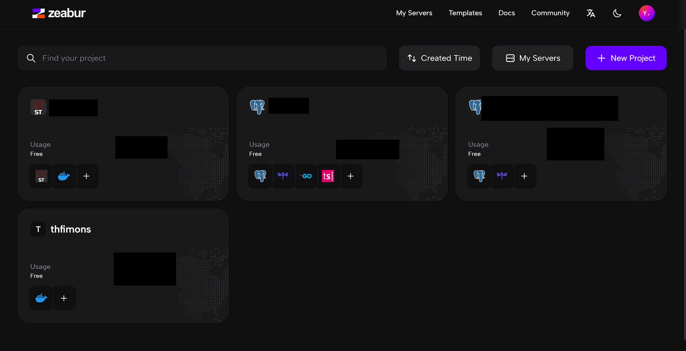
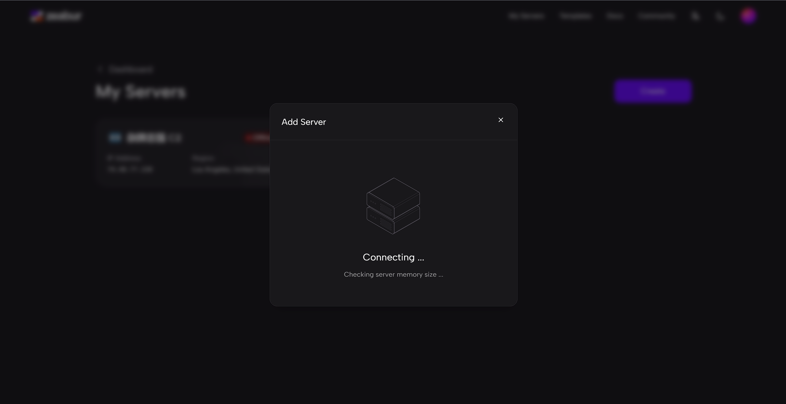
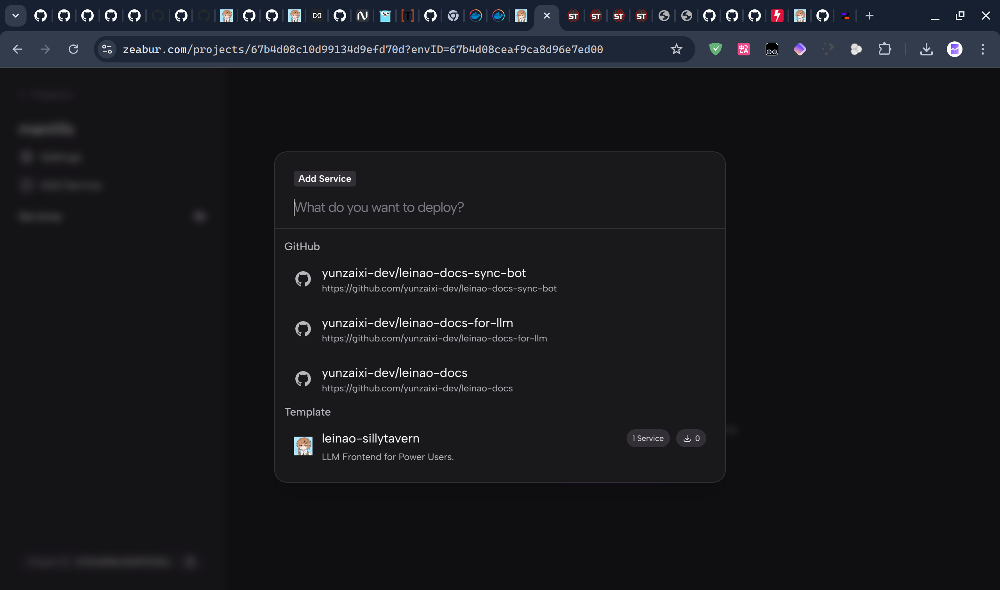
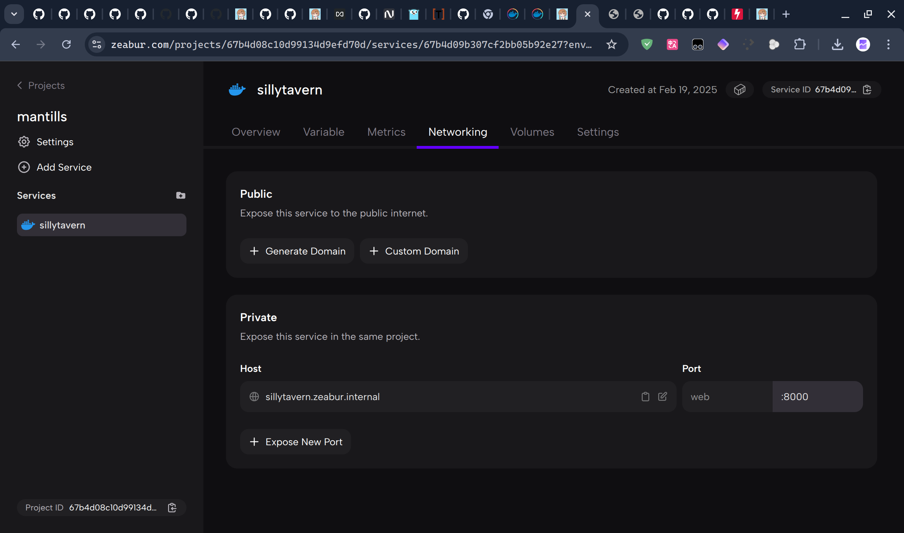
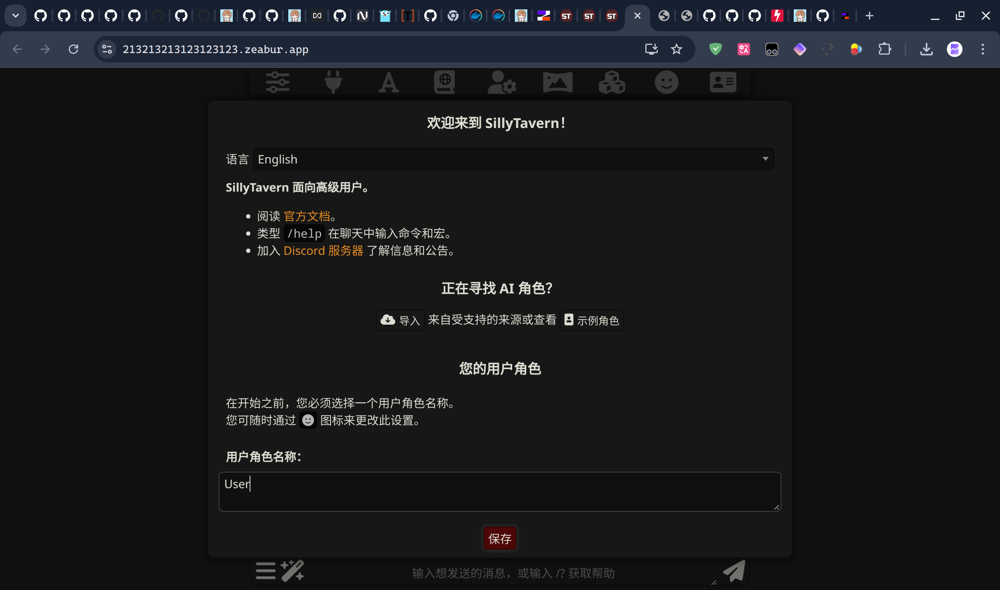

# 使用Zeabur一键部署自动更新的云酒馆

::: tip
本项目基于酒馆官方源代码仓库  
在开始前,你需要拥有一台海外vps(请参考其它教程获取),并注册[Zeabur](https://zeabur.com?referralCode=yunzaixi)账号  
若您是开发人员,拥有强大的运维基础,可以跳过本教程直接阅读zeabur官方文档  
:::

::: warning
请注意,VPS的最低配置为2GB内存,推荐使用ubuntu系统,而且必须为海外ip,响应速度取决于ip质量  
请检查VPS的防火墙是否关闭  
请确认VPS的密码是否填写正确(是否有多余空格)  
酒馆延迟取决于vps ip地址与你的物理距离  
:::

## 1. 注册Zeabur
::: tip
首先注册并登录[Zeabur](https://zeabur.com?referralCode=yunzaixi)  
:::
  
::: tip
进入项目界面,如图  
:::
  
::: tip
点击MyServer,进入Server界面,如图  
:::
  

## 2. 导入/创建Server
::: tip
点击Create,如图  
:::
  
::: tip
你可以选择购买Zeabur服务器,或是添加你已经购买的海外vps,这里我添加自己的服务器(如果UI越界就缩小浏览器比例,ctrl+鼠标滚轮)  
:::
  
::: tip
填写linux ip/用户名/密码(这些由你的vps提供商提供)后(点击connect by按钮切换ssh key与密码),点击Add,Zeabur会自动为您的服务器安装环境,这里需要等待一段时间  
:::
  
::: tip
安装完成后,刷新界面,查看新增的服务器
:::
  

## 3. 部署云酒馆服务
::: tip
首先回到项目界面,新建项目,按New Project按钮  
:::
  
::: tip
进入项目后点击add service,搜索ZS-sillytavern部署
:::

::: tip
等待部署完成,如图所示
:::

::: tip
进入network界面,点击generate domain获取免费或是使用自己域名  
免费域名可能提供得比较慢  
:::

::: tip
创建域名,点确定,等待域名提供
:::

::: tip
接下来用您的任意设备访问域名,就可以使用酒馆了
默认密码: root
默认密码: a20250219
建议前往setting --> config editer界面修改密码
:::

::: tip
完结撒花
:::